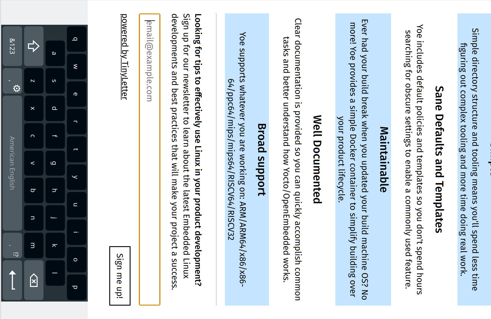

# Yoe Kiosk Browser

The Yoe Kiosk Browser is a Qt WebEngine (Chromium) based browser
designed for embedded kiosk (full screen, single app) applications. In this scenario, the UI for the device
web application that displays in browser running on the device.

## Features:

- designed to run fullscreen
- no URL bar
- embedded touchscreen virtual keyboard
- keyboard width can be configured
- supports 90° or 270° screen rotation

## To build

### On development machine

- install Qt dependencies
- `mkdir build`
- `cd build`
- `cmake ../`
- `make`

### On embedded Linux Systems

Use the Yoe Linux recipe.

## Reference

This project uses ideas from:

- [BEC Systems Kiosk Browser](https://github.com/cbrake/kiosk-browser/tree/qt-webengine)
- [Qt webview minibrowser](https://github.com/qt/qtwebview/tree/dev/examples/webview/minibrowser)
- [O. S. Systems qt-kiosk-browser](https://github.com/OSSystems/qt-kiosk-browser)
- [Qt Virtual Keyboard Examples](https://github.com/qt/qtvirtualkeyboard/tree/dev/examples/virtualkeyboard/basic)
- [Qt Web Browser](https://code.qt.io/cgit/qt-apps/qtwebbrowser.git/)
